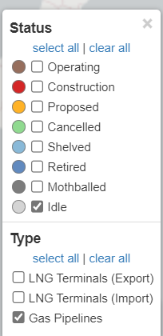
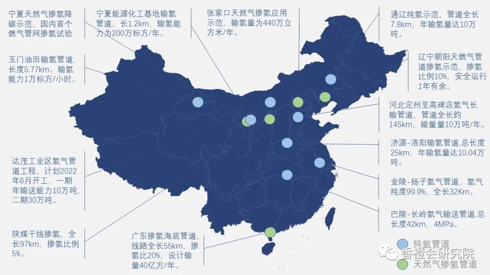
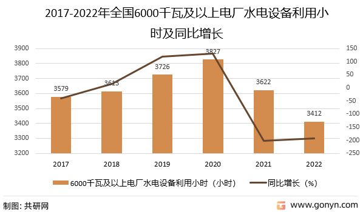

# 一、问题
## 背景
- 双碳目标
- 绿氢供需错配矛盾
- 能源的不公平性
- 能源安全。中国现在的能源结构中很大一部分都是依赖化石能源，如石油。中国进口原油从2018年开始已经超过了70%，已突破国际石油安全警戒线。氢气可以分化油气价格同向波动对国民经济的影响。
## 问题定义
__*以省份为最小单位完成下列任务__
### 氢能潜力评估

### 氢能网络架构
- 氢能节点配置
- 氢气输运方式规划 

# 二、问题分析

## 氢能产业链
生产——储运——应用

电解槽成本的下降将是电解清洁制氢早期成本下降的重要驱动因素

考虑出口能够保证中国在未来的能源经济中的地位。

## 氢能网络
氢能网络的建设是一项系统性工程，应根据市场发展初期、中期和远期不同阶段的需求特点，合理匹配低压高压、气态液态固态等各类储运方式，逐步提高氢气储存和运输能力。在规划氢能产业发展的过程中，各地要遵循需求导向的原则，自下而上布局生产、储运及相关基础设施建设，促进氢能供应链各环节的协调发展
根据氢能产业链，可将氢能网络抽象成三类节点。
### **产氢节点**
**潜力评价指标**

### **储氢节点**
**潜力评价指标**
- 天然的\
  1、地质洞穴
  2、油气田
  3、盐层、沉积层
  4、hardrock outcrop
  这些还可用于永久CO2储存，以支持清洁制氢。
- 人工的\
  1、氢载体：固态储氢材料、有机溶液等
###  **用氢节点**

**潜力评价指标**
# 三、模型假设

- 以省份为节点分析，不细分到市/区。节点具有非排他性，可以同时是产氢、用氢节点。
- 虽然电解水制氢的原料为水，但由于以省为单位的粒度较粗，不把水资源丰富程度纳入氢生产潜力的指标计算中。
- 基于低碳性、经济性的供求平衡
- 该研究所所长张锡良在一次网络研讨会上表示，到2050年，煤炭将被从能源结构中去除。
# 四、符号说明 
  | 符号 | 含义 | 单位 |
| :-----:| :----: | :----: |
| $PH_i$| 省i的氢气生产潜力 | $kg/km^2/year$ |
|  $PG_i$ | 省i的氢气生产量 | $kg/year$ |
|$\alpha_i$|生产化率| |
| $price_i$|省i的氢气价格|  $元/kg$|
| $ HC_i（price_i,t）$  | 省i的氢气消耗量|$kg/year$|
||||
||||
||||

# 五、模型建立

## 生产端
设省份i的氢气最大可生产量为 $MG_i$,实际氢能生产量为 $HG_i(t)(kg/y)$,氢能消耗量为$HC_i(t)$
对于每个氢能生产方式，
| 氢生产来源 | 转化率(kg/KWh) | 最大储量(KWh) |生产基地建设成本(\$/kg)|生产成本(\$/kg)|碳排放量(kg/kg)|生产量(kg/y)|
| :----: | :----: | :----: | :----: | :----: | :----: | :----: |
| s | $\alpha_s$ | $ME^i_s$ | $BC_s$ | $BP_s$ | $\beta_s$ | $HG^i_s(t)$ |

可以计算出每个省份的氢能生产量为
$$HG_i(t)=\sum_{s=1}^{S}HG^i_s(t)$$
其中$S$为氢能生产方式的种类数，$HG^i_s(t)$为第$s$种氢能生产方式在省份$i$的生产量,$HG^s_i(t) \le \alpha_s ME^i_s$。$HG_i(t)$为省份$i$的氢能生产量.
那么总生产成本为 

$$GC_i(t)=\sum_{s=1}^{S}HG^i_s(t)(BC_s+PC_s)$$
这里采用了假定建设了基地则全部投入使用的假设，即$BC_s$为建设成本，$PC_s$为生产成本，$GC_i(t)$为省份$i$的氢生产成本.
那么总碳排放量为
$$GEmission_i(t)=\sum_{s=1}^{S}\beta_sHG^i_s(t)$$

## 运输端
设从省份 i到省份j的氢气运输采用运输形式为 f
| 氢气运输方式 | 建设成本(\$ /kg) | 最大运输量(kg)  |运输成本(\$/kg)| 碳排放量(kg/kg)|运输量(kg/y)|
| :----:| :----: | :----: | :----: | :----: | :----: | 
| f | $BC_f$ | $MT^{ij}_f$| $TC_f$ | $\beta_f$ | $HT^{ij}_f(t)$ |
由于已经有建设的基础设置，因此建设成本与最大运输量的关系为
$$\begin{cases}
BC_f^{ij}=0 & \text{if } MT^{ij}_f<= MT^{ij}_f(0) \\
BC_f^{ij}>0 & \text{if } MT^{ij}_f >  MT^{ij}_f(0) \\
\end{cases}$$
其中$MT^{ij}_f(0)$为基础设施的最大运输量，$MT^{ij}_f$为实际最大运输量，$BC_f$为建设成本，
总建设成本为
$$
\begin{cases}
 BTC^{ij}(t)=\sum_{f=1}^{F}BC_f^{i,j}*(MT^{ij}_f- MT^{ij}_f(0)) & \text{ if } HT_f^{i,j}>0 \\
 BTC^{ij}(t)=0 & \text{ if } HT_f^{i,j}\le 0
\end{cases}
$$
为了防止重复计算，此处将运输成本算在对外送气的省，不会影响优化全国。\
总运输成本为
$$
\begin{cases}
 TTC^{ij}(t)=\sum_{f=1}^{F}HT^{ij}_f(t)TC_f & \text{ if } HT_f^{i,j}>0 \\
 TTC^{ij}(t)=0 & \text{ if } HT_f^{i,j}\le 0
\end{cases}
$$
其中$F$为运输方式的种类数，$HT^{ij}_f(t)$为第$f$种运输方式在省份$i$到省份$j$的运输量,$HT^{ij}_f(t) \le MT^{ij}_f$.
总成本为
$$TC^{ij}(t)=TTC^{ij}(t)+BTC^{ij}(t)$$
总碳排放量为
$$\begin{cases}
TEmission^{ij}(t)=\sum_{f=1}^{F}\beta_f HT^{ij}_f(t) & \text{if} HT^{ij}_f(t) >0 \\
 TEmission^{ij}(t)=0  & \text{if} HT^{ij}_f(t) \le 0
\end{cases}$$

<!-- 总能耗为
$$ETC^{ij}_f(t)=\sum_{f=1}^{F}HT^{ij}_f(t)ET_f$$ -->

## 消费端
消费端可以根据需求量来计算（我们将氢气的出口也当作省份的一种需求），设省份i的氢气需求量为 $HC_i(t)$
| 氢气消费方式 | 消费基地建设成本(\$/kg) | 氢气价格(\$/kg)|碳排放量(C/kg)|消费量(kg/y)|
| :----: | :----: | :----: | :----: | :----: |
| c | $BC_c$ | $Price_i$ | $\beta_c$ | $HC^i_c(t)$ |
那么总消费成本为
$$UC_i(t)=\sum_{c=1}^{C}HC^i_c(t)(Price_i+BC_c)$$
总碳排放量为
$$UEmission_i(t)=\sum_{c=1}^{C}\beta_cHC^i_c(t)$$
火箭发射场
## 省份间氢气运输的图模型
设省份i到省份j的氢气运输采用运输形式为 f，$HT^{i,j}_f(t)$为省份i到省份j的采用f方式氢气运输量，$|HT^{i,j}_f(t)| \le MT^{ij}_f$
正号表示从i到j，负号表示从j到i，即$HT^{i,j}_f(t)=-HT^{i,j}_f(t)$

那么对于一个省份i,满足氢气平衡，即生产量等于运输到其他省的量(负值则为其他省输送进来的量)+自身的消耗量，即
$$HG_i(t)=\sum_{j=1}^{N}\sum_{f=1}^{F}HT^{i,j}_f(t)+HC_i(t)$$
其中$N$为省份的数量，$F$为运输方式的种类数。

总经济成本为

$$ Cost= \sum_i^N (GC_i(t)+\sum_jTC^{i,j}+UC_i(t))$$
总碳排放量为 
$$Emission=\sum_i^N(GEmission_i(t)+\sum_jTEmission^{i,j}(t)+UEmission_i(t))$$
## 优化模型
我们的目标是最小化总的经济成本或者总碳排放量，即
$$\min_{HG_i(t),HT^{ij}_f(t),HC_i(t)} Cost$$
$$\min_{HG_i(t),HT^{ij}_f(t),HC_i(t)} Emission$$
$$s.t. HG_i(t)=\sum_{j=1}^{N}\sum_{f=1}^{F}HT^{ij}_f(t)+HC_i(t)$$
$$HT^{ij}_f(t)=-HT^{ji}_f(t)$$  
$$ HT^{ij}_f(t) \le MT^{ij}_f$$

# 六、案例与结果分析
以远期规划为例

## 生产端

| 电来源 | 最大可使用量 |电价|碳排放量(kg/kg)|生产量(kg/y)|电制氢转换率KWh/kg H2|
| :----: | :----: | :----: | :----: | :----: | :----: |
| s | $M_s$ | $Price_s$ | $\beta_s$ | $HG^i_s(t)$ |$\gamma$|
|光电|$M_{solar}$|$1$|$2.04$||$53$|
|风电|$M_{wind}$|$1$|$0.68$||$53$|
|水电|$M_{hydro}$||||$53$|
|核电||||||
<!-- |化石燃料|$\alpha_{fossil}(t)$||||||
|工业副产|$\alpha_{bypdt}(t)$|||||| -->

$\beta_s$碳排放量：数据来自“典型制氢工艺生命周期碳排放对比研究”\
$M_s$:向量，包含每个省份，数据来自“Assessment of wind and photovoltaic power potential in China”\
$Price_s$：完全竞争市场假设/全国统一价假设

$\gamma$: 来自 https://en.wikipedia.org/wiki/Electrolysis_of_water

$M_{hy}^i$ 周建平,杜效鹄,周兴波.“十四五”水电开发形势分析、预测与对策措施[J].水电与抽水蓄能,2021,7(01):1-5.

https://www.sohu.com/a/648879842_121388092

## 运输端
设从省份 i到省份j的氢气运输采用运输形式为 f
| 氢气运输方式 | 建设成本(\$ /km) | 最大运输量(kg)  |运输成本(\$/kg)| 碳排放量(kg/kg)|运输量(kg/y)|
| :----:| :----: | :----: | :----: | :----: | :----: | 
| f | $BC_f$ | $MT^{ij}_f$| $TC_f$ | $\beta_f$ | $HT^{ij}_f(t)$ |
|掺氢天然气管道|25万|$MT_{blend}$|$2.0-8.3$|||
|纯氢管道|63万|$MT_{pure}$||||
|高压氢气路运||||||
|低温液氢路运|||||||
|固态、有机液体路运||||

$\beta_f$:这个怎么算?不用算

$MT_{blend}(0)$：来自"https://globalenergymonitor.org/projects/global-gas-infrastructure-tracker/tracker"\
$MT_{pure}(0)$：来自“https://www.gov.cn/yaowen/2023-04/10/content_5750685.htm”\
$BC_f$:建设成本，通过GIS地形图评估地理条件得出\
$TC_{blending}$:运输成本（），来自“Blending Hydrogen into Natural Gas Pipeline Networks: A Review of Key Issues”

#### 纯氢管道中国建设现状

从实际建设情况来看，我国纯氢管道建设处于起步阶段，规模较小。管道具体情况如下：

但这些管道对于氢气输送来说，远远不够。从制氢产地看，多集中在与煤炭化工比较切近的北方地区，即使新兴的风光储氢一体化项目的可再生能源制氢基地也多是建设在北方地区，而作为氢能用能基地的南方只能依靠输氢来解决氢气来源问题，氢能需求量巨大，对氢能输送管道的需求也极大。目前市场有待开发，管道有待多建。

| PipelineName         | Length/km | Capacity/ton/year | Start and end province        | source | usage       |   |   |   |   |
|----------------------|-----------|-------------------|-------------------------------|--------|-------------|---|---|---|---|
| 金陵—扬子氢气管道            | 32        | 4万                | Jiangsu-Jiangsu               | 煤      | 为石化行业提供生产原料 |   |   |   |   |
| 巴陵—长岭氢气提纯及输送管线       | 42        | 4.42万             | Hunan-Hunan                   | 煤      | 为石化行业提供生产原料 |   |   |   |   |
| 济源—洛阳氢气管道            | 25        | 10.04万            | Henan-Henan                   | 煤      | 为石化行业提供生产原料 |   |   |   |   |
| 定州—高碑店氢气管道工程         | 164.7     | 10万               | Hebei-Hebei                   | 焦炉煤气   | 燃料电池        |   |   |   |   |
| 玉门油田水电厂氢气输送管道        | 5.5       | 0.7万              | Gansu-Gansu                   | 水电     | 生产原料        |   |   |   |   |
| 乌兰察布陆上风电制氢一体化工程和输氢管道 | 400       | 10万               | Inner Mongolia-Beijing        | 风电     | 为石化行业提供生产原料 |   |   |   |   |
| 乌海-呼和浩特输氢管道          | 500       | /                 | Inner Mongolia-Inner Mongolia | 焦炉煤气   | 液氢商业化应用     |   |   |   |   |
|                      |           |                   |                               |        |             |   |   |   |   |
|                      |           |                   |                               |        |             |   |   |   |   |

## 消费端

| 氢气消费方式 | 消费基地建设成本(\$/kg) | 氢气价格(\$/kg)|碳排放量(C/kg)|消费量(kg/y)|
| :----: | :----: | :----: | :----: | :----: |
| c | $BC_c$ | $Price_i$ | $\beta_c$ | $HC^i_c(t)$ |
|贸易：氢能出口|||||
|能源：氢能叉车、重卡、船舶|||||
|能源：航空器液氢燃料|||||
|能源：加氢站、储氢站|||||
|能源：燃料电池热电联供|||||
|工业原材料：合成氨||||
|工业原材料：甲醇
|工业原材料：炼化

$\beta_c$  消费氢气的设备的碳排放需要算入吗\
H2炼铁的比例：https://worldsteel.org/wp-content/uploads/Fact-sheet-Hydrogen-H2-based-ironmaking.pdf \
H2炼铁转换率: https://www.energy.gov/sites/prod/files/2018/08/f54/fcto-h2-scale-kickoff-2018-8-chevrier.pdf

# 七、讨论
在更细化的层面上，水资源的区域可利用性也是影响制氢设施选址和可持续性的重要因素

与“一带一路”国家开展氢能贸易

